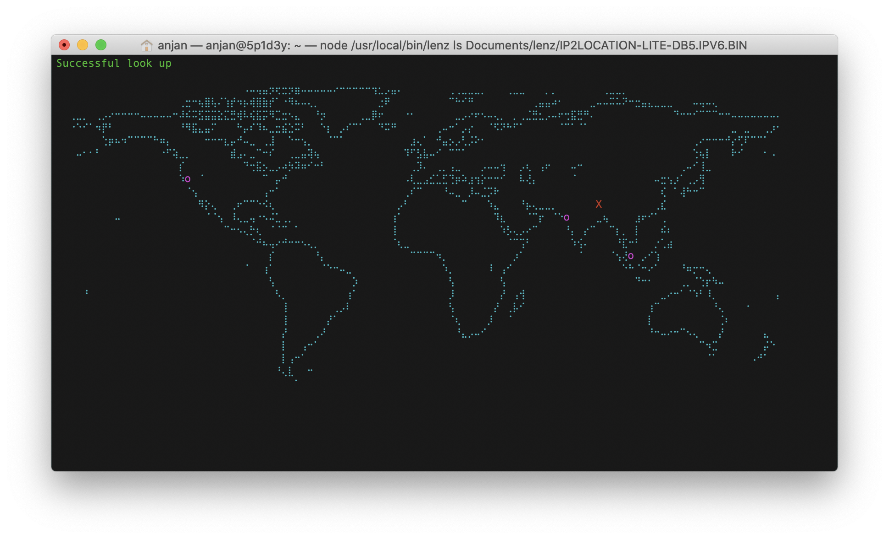
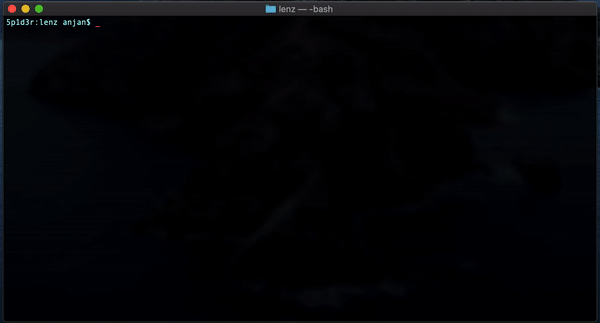
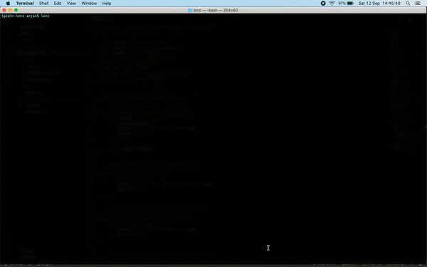
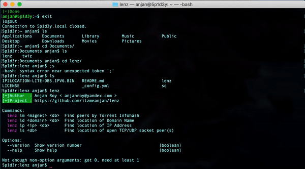
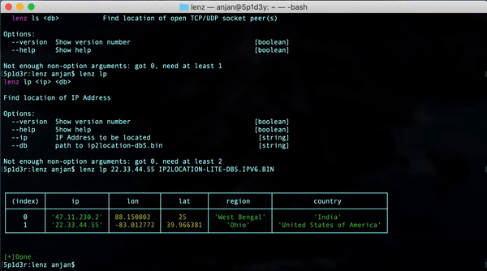
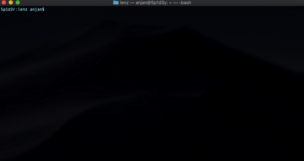

# lenz 🤓

[]() []() []()

Console based MAP 🗺, with lots of features packed in **< 30 kB**



## Table of Contents

- [Why did you write this software ?](#motivation)
- [What's in box ?](#features)
- [What do I need to use it ?](#prerequisite)
- [How do I install it ?](#installation)
- [How do I use it ?](#usage)
- [Can I add one new feature ?](#contribution)

## motivation

I was looking for one fully console based geo location data visualiser, with below functionalities 

- can geo locate machine's connected TCP/ UDP peers 👩‍💻
- can geo locate any IP Address
- can geo locate all IPv{4,6} addresses, resolvable from (sub-)domain name
- can geo locate peers, given torrent 🧲 link
- _can show my own location on Map_ 🙋

which can be used in fully console based environments i.e. ssh-ing into VM, VPS etc.

But couldn't find one, may be I required to try harder. So I decided to write one, with all these above mentioned functionalites.

I interested in extending its functionalites in coming days, if you find I'm missing certain use case, feel free to let me know/ just raise a PR.

## features

- Given (sub-)domain name, it can look up all associated server IPv4/6 addresses, showing them in console map 🥴
- Given IPv4/6 address, can lookup it's location & show it in console map 🥳
- Can find all active TCP/UDP socket connections & marks their respective peers in console map 🤩
- Given torrent 🧲 link, can look up all peers associated with that infohash & show them in console map 🤓
- Given any random URL, parses HTML & extracts out all static content i.e. {`*.js`, `*.css`, `image/*`} delivery domains & geo locate them 😎

In all these cases, generates a tabular report of all connected peers _( including self )_, who were shown on console map

## prerequisite

We need to download [IP2Location™ LITE IP-COUNTRY-REGION-CITY-LATITUDE-LONGITUDE Database](https://lite.ip2location.com/database/ip-country-region-city-latitude-longitude) for using this tool.

Consider using IPv6 Binary version, cause that will also support IPv4 lookup. This specific database I've planned to use is codenamed **db5**.

Please try to stick with that, otherwise there might be some unexpected behaviours.

And we need to have NodeJS( >10.X ).

## installation

### using NPM

This [software](https://www.npmjs.com/package/lenz) is distributed using NPM.

```bash
npm i -g lenz
```

### using GITHUB

You can clone this repo in your machine and run below commands to use this CLI tool.

Lets get into project directory

```bash
git clone git@github.com:itzmeanjan/lenz.git
cd lenz/lenz
npm install # installing all dependencies
```

And install tool globally. Also make sure you've added NPM global installation path to your system **PATH** variable.

```bash
npm i -g .
```

Now you can use `lenz` from any where in your directory tree.

## usage

Invoke `lenz` from CLI, supplying proper params for each of supported commands.

> ❌ : Your location, using IP address

> ⭕️ : Peer(s) location

```bash
5p1d3r:lenz anjan$ lenz
[+]Author  : Anjan Roy < anjanroy@yandex.com >
[+]Project : https://github.com/itzmeanjan/lenz

Commands:
  lenz lm <magnet> <db>  Find peers by Torrent Infohash
  lenz ld <domain> <db>  Find location of Domain Name
  lenz lp <ip> <db>      Find location of IP Address
  lenz ls <db>           Find location of open TCP/UDP socket peer(s)

Options:
  --version  Show version number                               [boolean]
  --help     Show help                                         [boolean]

Not enough non-option arguments: got 0, need at least 1
```

> Please use tool's help option for getting more info related to supported commands.

### show peers by magnet link ( lm )

Get a magnet link & supply it while invoking `lenz`



```bash
5p1d3r:lenz anjan$ lenz lm
lenz lm <magnet> <db>

Find peers by Torrent Infohash

Options:
  --version  Show version number                               [boolean]
  --help     Show help                                         [boolean]
  --magnet   torrent 🧲 link                                    [string]
  --db       path to ip2location-db5.bin                        [string]

Not enough non-option arguments: got 0, need at least 2
```

### look up by domain name ( ld )

Domain name to be resolved to IPv _{4,6}_ addresses & shown on console map.



```bash
5p1d3r:lenz anjan$ lenz ld
lenz ld <domain> <db>

Find location of Domain Name

Options:
  --version  Show version number                               [boolean]
  --help     Show help                                         [boolean]
  --domain   domain name to be looked up                        [string]
  --db       path to ip2location-db5.bin                        [string]

Not enough non-option arguments: got 0, need at least 2
```

### look up by ip address ( lp )

Looks up IPv _{4,6}_  address location & shows on console map.



```bash
5p1d3r:lenz anjan$ lenz lp
lenz lp <ip> <db>

Find location of IP Address

Options:
  --version  Show version number                               [boolean]
  --help     Show help                                         [boolean]
  --ip       IP Address to be located                           [string]
  --db       path to ip2location-db5.bin                        [string]

Not enough non-option arguments: got 0, need at least 2
```

### find all active TCP/UDP sockets ( ls )

Finds out all active TCP/UDP socket connections & their peers, which are then shown on console map



> **Note** : This feature is only available on darwin & gnu/linux, as of now

> It has runtime dependency on `lsof` & `awk`

> These two tools are run as child processes of `lenz`

```bash
5p1d3r:lenz anjan$ lenz ls
lenz ls <db>

Find location of open TCP/UDP socket peer(s)

Options:
  --version  Show version number                               [boolean]
  --help     Show help                                         [boolean]
  --db       path to ip2location-db5.bin                        [string]

Not enough non-option arguments: got 0, need at least 1
```

### Locate static content delivery domains used in a webpage ( lr )

Given any webpage URL, parses out its `script`, `link` & `img` tags, which are used for including static resources into HTML i.e. CSS, JS & images. If they are delivered from some domain other than this one, extract them out & then resolve those domain names into IPv4/6 addresses, which are to be geolocated using IP2Location DB5 database. They are also shown on console map.



```bash
5p1d3r:lenz anjan$ lenz lr
lenz lr <url> <db> [dump]

Locate static content delivery domain(s) used by URL

Options:
  --version  Show version number                               [boolean]
  --help     Show help                                         [boolean]
  --url      inspect for finding static content delivery domain(s)
                                                                [string]
  --db       path to ip2location-db5.bin                        [string]
  --dump     path to sink-file.json      [string] [default: "dump.json"]

Not enough non-option arguments: got 0, need at least 2
```

### Geo Locate IPv4 addresses owned by some Autonomous System ( la )

Given Autonomous System Number [ `ASN` ] of a certain organization, finds all IPv4 address ranges controlled by `ASN`, and geo locate them using IP2Location DB5 database, which are to be shown on console map.

For using this command we need two IP2Location database

- [IP2Location™ LITE IP-COUNTRY-REGION-CITY-LATITUDE-LONGITUDE Database](https://lite.ip2location.com/database/ip-country-region-city-latitude-longitude)
- [IP2Location™ LITE IP-ASN Database](https://lite.ip2location.com/database/ip-asn)

```bash
5p1d3r:lenz anjan$ lenz la
lenz la <asn> <db> <asndb>

Geo locate IPv4 addresses owned by Autonomous System

Options:
  --version  Show version number                               [boolean]
  --help     Show help                                         [boolean]
  --asn      autonomous system number to be looked up
  --db       path to ip2location-db5.bin                        [string]
  --asndb    path to ip2location-ipv4-asn.db                    [string]

Not enough non-option arguments: got 0, need at least 3
```

## contribution

If you're interested in adding more features to this CLI tool, please raise a PR.
